# Morserino-32: Detailed Assembly Instructions
*Version December 2020 - Valid for 1st and 2nd edition of Morserino-32*

### Before you begin:

* **While the kit is rather easy to assemble, you should have some kit-building experience.** If not, I strongly suggest that you get some help from someone who has that experience. Even kits that are easy to build can be ruined (of course I can supply you with spare parts should something bad have happened - but you will understand that I cannot do so for free - I have to buy the parts myself.)

* Make sure you know which type of LiPo battery you are going to use, and where you are going to mount it:
	* If it is small enough it should fit under the Heltec module.
	* Otherwise you should mount it to the bottom plate of the case, making sure you have enough clearance between the battery and the PCB (**Danger!** **Make sure no sharp ends of wires etc. are doing any harm to the LiPo battery** - this could result in exploding batteries!). Two different sizes of stand-off bolts have been supplied - use the 12mm ones if your battery sits on the bottom plate; if it is VERY thick you could even combine the 6 mm and the 12 mm stand-offs to give you 18 mm of clearance! If you do not need extra space below the PCB, use the 6 mm stand-offs.
	* I am assuming that you are going to use a battery with a Molex connector - should you prefer a battery with a different connector, you need to supply our own cable with a fitting connector for the battery.
* **Get all the necessary tools**: a fine-tipped soldering iron, thin solder wire (do not use lead-free solder unless you want to make your life hard), good lighting, possibly a magnifying glass, a small wire cutter and (for assembling the case) the small hex wrench (2 mm) provided with the kit.

* **Soldering advice:** Do NOT use lead-free solder (I mentioned it before, didn't I). Use a high quality soldering iron, set to a reasonable temperature (I prefer them to be a bit on the high side - allows you to make the joints quickly, and some of the parts are biggish; if connected to ground, you need a lot of heat to make the joint, and staying there with the iron for many, many seconds waiting for the warm-up is a good way to ruin your PCB).

* Check that all components are ready - identify them with the help of the packing list, and identify where they will go, with the help of the placement drawing. Please notify [mailto:info@morserino.info](mailto:info@morserino.info) if any components are missing or defective, so that some replacement can be sent to you!

Please not that in edition 2 there are two trimmer potentiometers, one (500 or 1000 Ohm) with a small knob for fingernail adjustment!

 **Note**: *The trimmer with a knob can be 500 or 1000 Ohm, depending on availability - there is no difference in functionality.*
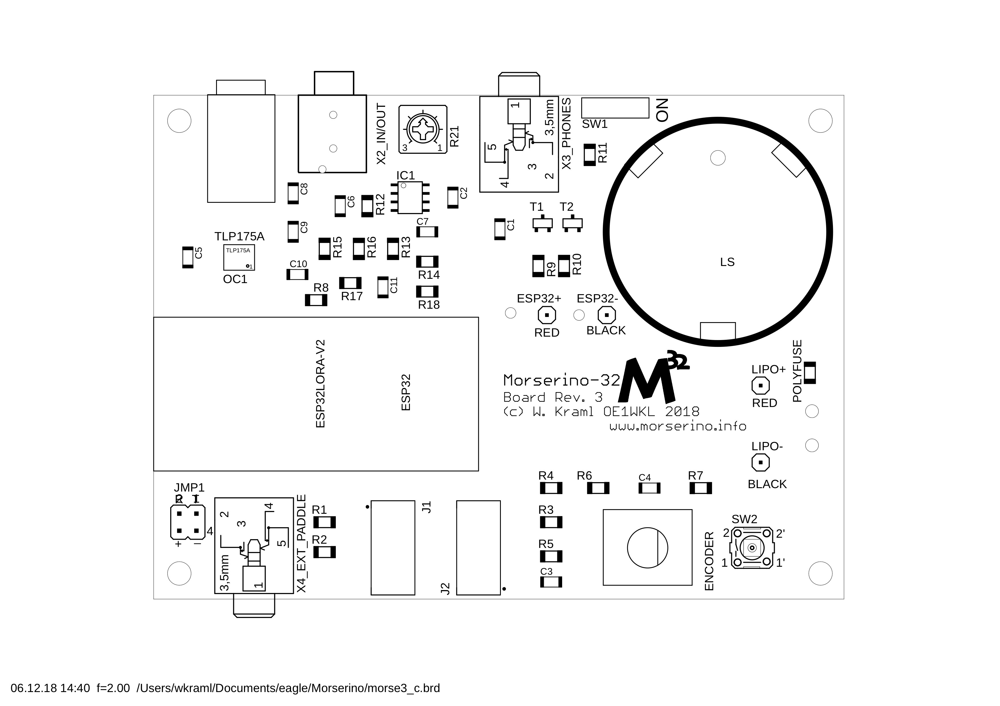

*Placement of parts, 1st edition*

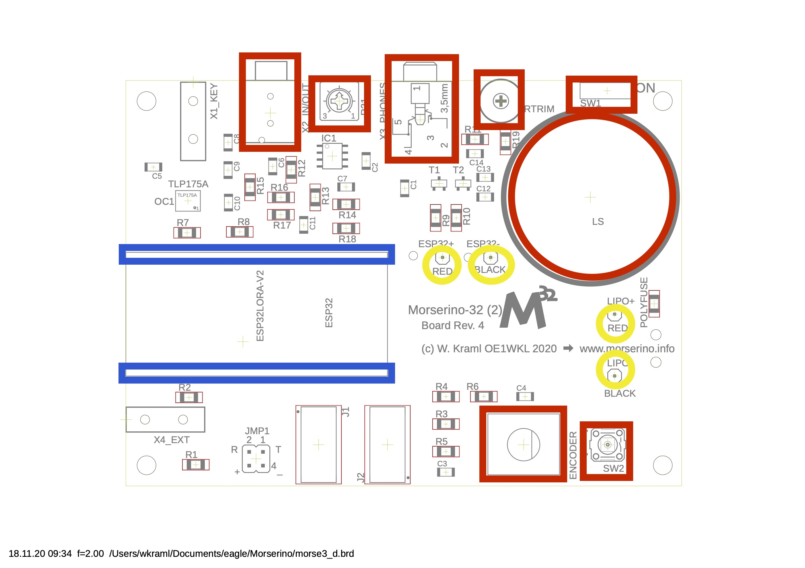

*Placement of parts, 2nd edition (red = parts, blue = female pin headers, yellow = cable connections)*

### Step-by-step instructions (at least read them, even if you decide to do it differently)

1. First solder the following components to the PCB: The  phone jacks (2 different types - 3 in edition 1 -, but it is easy to see which one fits where); then the trimmer resistor between the jacks (**its orientation does not matter** - the silk screen on the PCB and the markings on the trimmer do not really fit together), and for the 2nd edition the other trimmer (the one with the knob) close to the loudspeaker; as these trimmer are hard to source and depending on availability have different footprints, there are more holes than needed on the PCB, to allow for all variants to be fitted.  It is important that the trimmer sits on the edge of the board, and that each leg is in one of the vertically aligned holes (marked with vertical lines on the top side of the PCB; see the pictures).

    
 

2. Now comes the sliding switch (the lever facing outward, of course), then the rotary encoder and the push-button switch (be particularly careful with this one - it has a tendency to end up slightly slanted - it might not nicely fit the hole in the top plate in such a case. Make sure it sits really flush on the PCB). This switch has protruding "noses" on its case - one of them should be facing towards the long edge of the PCB, and the other - obviously - towards the loudspeaker.

3.	You will find all these components in the pink plastic bag (see also the picture at the end of this document). Do not yet solder the 2 female pin headers, the cables and the loudspeaker.  Make sure all components are flush on the PCB - especially the rotary encoder, the trimmer(s) and (I mentioned it) the push button switch (otherwise the case might not fit very well). Make sure the sliding switch is in the "OFF" position (towards the phone jack).

4. Connect the cable with the small 1.25 mm JST connector to the connector on the underside of the Heltec module (be careful not to push the socket on the module off the board with brute force - hold it with your finger). The red wire must be on the side of the + sign printed on the module.

 

 *Orientation of Power cable*

  

 *Attaching Power cable*

5. Put the female pin headers (18 positions) onto the pins of the Heltec module, again making sure they are sitting flush on the module.
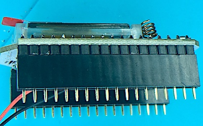

 *Attached pin headers*

 **Be very careful when handling the Heltec module! Do not apply pressure to the display or the cable connecting the display, or the coil antenna** - these things are very brittle and break easily. **Hold the Heltec module by its PCB only and slowly wiggle the header onto the pins!**
 
 If you want, you can glue the sticker with the pin designation of the Heltec module on the side of the module's pins (but this is by no means necessary): On the side of the paddles the sticker with "GND" to "16", opposite the one with "GND" to "21". "GND" is always close to the USB socket.

6. Put the Heltec module with its attached headers carefully onto the PCB, so that the USB connector is positioned on the edge of the PCB, and making sure you are not bending any pins; then solder the header pins to the PCB, again making sure that everything sits very flush on the PCB.

7. Solder the ends of the cable that dangles from the Heltec module to the pads marked ESP32+ (red) and ESP32- (black) on the top of the PCB, after threading the wires through the holes besides the pads (intended as strain relief), and threading them into the pad holes **from below**.  **Do not make a mistake with the polarity of the cable - doing so will almost certainly destroy the Heltec module!**

8. **(Optional):** Shorten the battery cable with the Molex connector  - the length depends on where you will put the battery. If it will sit under the Heltec module, it should be around 3-4 cm (1.2 - 1.5 inches) long. Remove the insulation for about 3 mm (1/8 inch), and tin the ends carefully.

	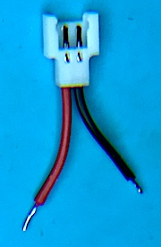

	*Shortened Power cable*

9. If the battery will sit under the module, thread the battery cables from the top of the PCB through the holes besides the pads LIPO+ and LIPO-, and then into the holes of the pads, and solder them on the top side of the PCB. If your battery will sit underneath the PCB, shorten the cable to a convenient length, thread them from underneath through the strain relief holes and into the pad holes, and solder them on the bottom side. Top and bottom sides of the PCB are marked so that you will find the correct pad. **Do not make a mistake with the polarity of the cable - doing so will almost certainly destroy the Heltec module!**

 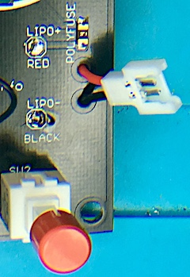

 *Power cable installed for battery under the Heltec module*

10. Solder the loudspeaker to the PCB (this is last, because it will make soldering the cables on the top side difficult once the speaker sits on the board). The speaker for the 2nd edition has markings (+, -) - I don't think that the polarity matters, but I put the + side towards the edge of the board.

11. Put the black knob onto the shaft of the encoder (inside the know there are two small guiding ledges that need to be aligned with the flattened side of the shaft), and the red cap onto the shaft of the push button switch.

12. If the battery sits under the the module, place it there and fix it with a small strip of double sided adhesive (like cellotape, but sticky on both sides). Do not use thick double sided adhesives, as the battery might then not fit under the module with enough clearance!
	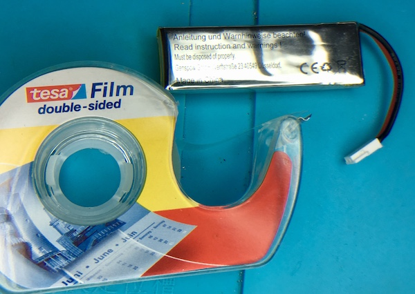

	*Thin double sided tape*

13. **(Recommended):** I would now check the battery connector with an Ohm meter after setting the sliding switch to the ON position, to see that we did not create a short circuit anywhere. It should show a relatively high resistance (> 100 kOhm). If it shows close to 0 Ohms, check the cabling! Slide the switch into the OFF position again.

14. Plug the battery cable into the Molex connector.

15. Put the paddles into the PCB connectors (left and right paddle are the same, so you cannot make a mistake here). **Remove the yellow sticky tapes from the connectors before you insert the paddles!** (These have been applied by the manufacturer and are necessary for the pick & place robots.)

    

16. Remove the protection foils from the acrylic glass plates (there is no foil on the engraved side). This can be tricky - try with a finger nail in one of the corners, or use strong sticky tape to losen the foil at a corner).

17. First mount the 15mm standoff bolts (female/female) with the supplied metal screws to the top plate of the case; the stand-offs should be under the plate with the engraved inscriptions readable from above.

18. Mount the antenna connector to the top plate, using the serrated washer on the underside, and the split washer and nut on the top side (it should sit firmly, but do not exercise too much pressure on to the acrylic glass, as otherwise it might crack; check if it sitting firmly from time to time - connecting and removing the antenna often could make it come loose over time).

	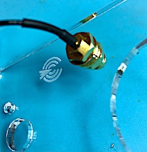

	*SMA connector*

19. Press the tiny IPX coax connector onto the coax socket on the HeltecHeltec module. A magnifying glass might help with this step, and a small flat screwdriver. Put the connector flat onto the socket, and apply some pressure vertically from the top  with the flat side of the screwdriver (not sideways!).

20. Now mount the top plate with its stand-off spacers to the PCB, using either the 6 mm male/female stand-offs (if the battery will sit under the Heltec module) or the 12 mm male/female stand-offs (if the battery will sit under the PCB and needs a bit more space) on the underside of the PCB.

 Carefully make sure the display fits into the opening, as well as the little coil (WiFi antenna). Make sure the battery cables and the antenna cable run smoothly and are not obstructing the encoder or the push-button switch.
**Be careful not to break the copper coil (WiFi antenna), and do not bend, apply pressure or break the flexible connector to the display! Do not exercise any pressure to the display!**

 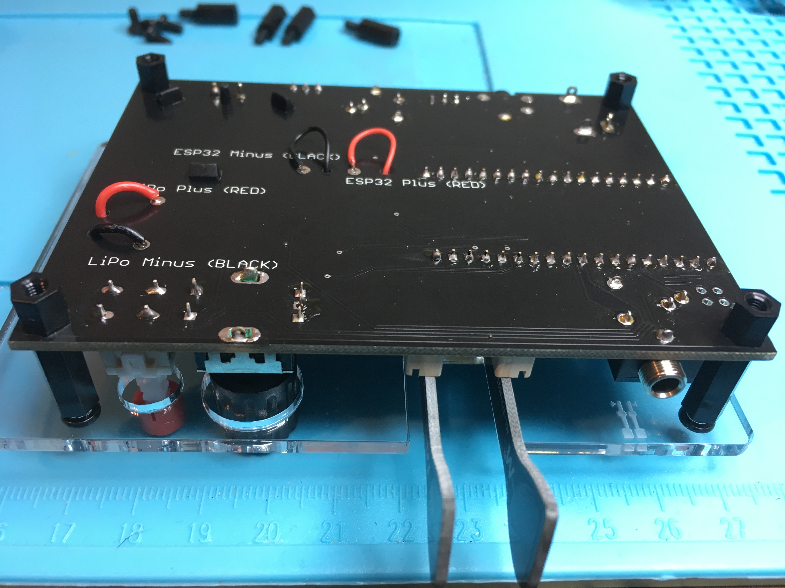

 *View from below*

21. If the battery will sit on the bottom plate, fix the battery now (with double-sided adhesive tape) and plug it in.

22. Now fix the bottom plate to the stand-offs with the supplied metal screws.

23. Stick the adhesive feet onto the bottom plate, besides the screws.

24. Screw the antenna to the antenna connector. (**Of course, you only need the antenna when you are transmitting with LoRa; but be aware, that transmitting without an antenna will eventually destroy the LoRa transceiver on the Heltec module!** Better safe than sorry!)

25. **(Optional, but recommended):** Go to the end of this document, and perform the **testing procedure** (and trouble shooting, if necessary).

26. Slide the battery switch to "ON" and start using the Morserino-32! If you do not have a battery yet, you can use the USB cable to connect to a 5V source, either from your computer or a phone charger or similar. As the module has been programmed already, you can use the Morserino-32 immediately. **See the User Manual** on how to use it and learn about its many functions. You can also update the software, should there be a newer version available - this is also described in detail in the User Manual.

27. Should you be looking for a box for storing (and transporting) your Morserino, I would recommend a plastic lunch box as a very cost effective solution (see the photo; I would also recommend some foam inserts in addition).

	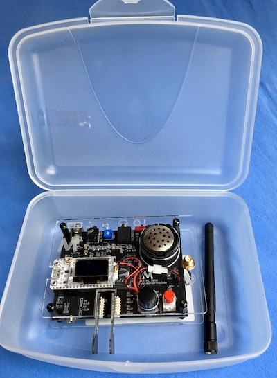

	*Storage in a lunchbox*

### Choice of LiPo battery for the Morserino-32

For my Morserinos I use a small 600 mAh single-cell LiPo battery that is commonly used in RC devices like quadcopters etc. The brand I use is „Tattu“ and has the following specs (see https://www.gensace.de/tattu-600mah-3-7v-30c-1s1p-lipo-battery-pack-with-molex-plug-1-pcs-pack.html or https://www.gensace.de/tattu-600mah-3-7v-30c-1s1p-lipo-battery-pack-with-molex-plug-1-pcs-pack.html):

**Tattu** 600mAh 3.7V 30C 1S1P Lipo Battery Pack with Molex Plug

* Capacity: 600mAh
* Voltage: 3.7V
* Max Continuous Discharge:30C (18A)
* Weight: 15.7g
* Dimensions: 60 x 19 x 7mm

See the picture below; Tattu is the battery at the top).

Of course you can use similar batteries from other manufacturers; in order to fit under the micro controller the **maximum dimensions** are: **65 x 20 x 8 mm**.

It must be a single cell LiPo (nominally 3.7 V), and should have a Molex plug (because a cable with such a connector is part of the kit - if you use a battery with a different type of connector, you need to supply your own cable for connecting it to the Morserino-32!).

You can use larger batteries if you mount them under the PCB, on the bottom plate of the case. To give you more flexibility, the kit will contain 6mm and 12mm distance bolts for mounting to the bottom plate. This means you can use pretty large LiPos, as long as they are < 10 mm thick. If you use the 6mm and 12 mm stand-offs in combination, you could even use batteries that are up to 16 mm thick! You have to make sure that you mount the battery in such a way that it is impossible for any sharp metal spikes to scratch the surface of the battery - this could lead to fire or explosion!

One option would be this type (in the picture the battery at the bottom):
https://www.amazon.de/gp/product/B01JJ6DA7A/ or this type: https://www.amazon.com/FPVERA-Battery-Connector-Charger-Quadcopter/dp/B089R8SGJR/ even that one, for even more capacity: https://www.gensace.de/gens-ace-3500mah-3-7v-tx-2s1p-lipo-battery-pack-with-jr-plug.html (but be aware that this one does not use a Molex plug - you would need to find a cable with a suitable plug to connect this to your Morserino-32).
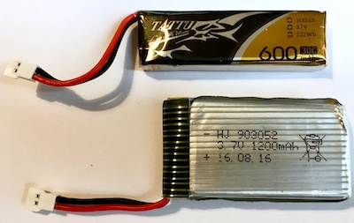

*Two usable types of battery*

## Appendix: Components

*These pictures show the components for the 2nd edition of the Morserino-32. First edition is similar.*

***Box contents:*** *A: Bag with components, B: Bag with PCB, C: Box with Heltec module, D: Case parts (2 acrylic plates, screws, stand-offs, feet, hex wrench), E: Cables (antenna cable assembly, Heltec power cable, battery cable, all 3 usually packed in Heltec box).*

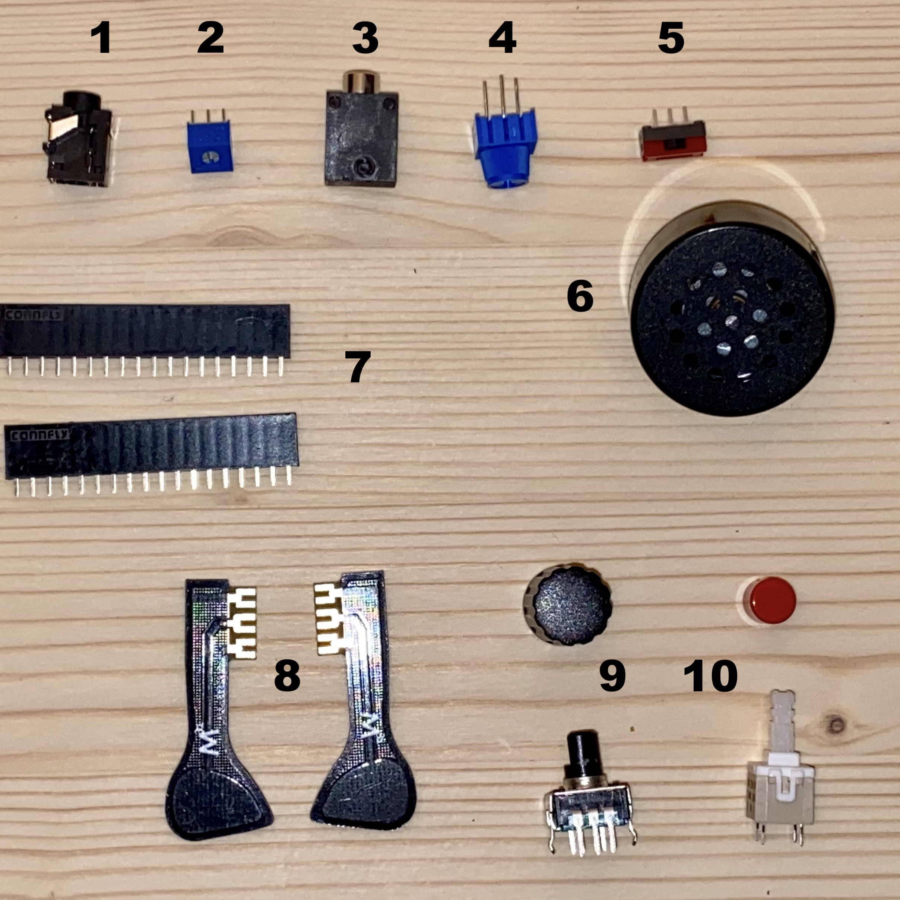

***Component bag contents, laid out as they will sit on the PCB:*** *1: 4-pole jack, 2: Trimmer, 3: 3-pole jack, 4: Trimmer with knob, 5: Sliding switch, 6: Loudspeaker, 7: Female pin headers with 18 poles, 8: Touch paddles, 9: Rotary encoder and black knob, 10: Push button switch and red cap.* **Note for 1st edition:** There is no item #4, and there are 2 pieces of item #3 in the bag for the 1st edition; there is also an additional 2-pole jack. Loudspeaker looks differently.

## Appendix: Morserino Test after Assembly & Trouble Shooting

#### Goal
Check to see if the following components seem to be working, and instructions how to fix problems
(should cover well over 95% of all problems seen so far):

* Display
* Loudspeaker / Headphones
* Encoder rotating function
* Encoder switch
* Touch paddles
* RED button switch
* Audio Line Input / Output
* Optocoupler to key transmitters / transceivers

###### Optional:
* External Paddle
* External straight key
* Battery

##### Not covered by this test:
* LoRa functionality
* WiFi functionality

(There is not much in terms of assembly error that could happen here, apart from not correctly attaching the LoRa 432 MHz antenna cable and antenna.)

#### Preparation - you will need:
* Standard build Morserino-32 with touch paddles attached
* Audio cable with 3.5 mm 4-pole auto jacks on both ends
* Audio cable with 3.5mm 2-pole or 3-pole jacks on both ends
* Alligator clips cable (with very small clips)
* Small flat screw driver to operate the blue trimmer
* Ohm meter
* Headphones
###### Optional:
* External paddles with 3.5 mm jack
* Straight key with 3-pole 3.5 mm jack
* LiPo battery for Morserino

Some general advice should you run into any difficulties, or have questions that seem not to be answered in this document or in the user manual: **join the Morserino user group** on groups.io (<https://groups.io/g/morserino>). Lots of knowledgeable people are monitoring it, and it probably is the shortest path to a useful response!

#### Testing & Trouble Shooting Procedure

(See picture to identify Heltec pins for re-soldering Heltec sockets.)

1. Power Up through USB (power switch in OFF position) - start up screen and menu should appear and show good readability. DISPLAY OK.

 *If it doesn't work*: If the display remains dark, or shows missing lines, it is defect and the Heltec module needs to be replaced.

2. Rotate BLACK knob - should bring up different menu items. Rotate in both directions. ENCODER function OK.

 *If it doesn't work*: Re-solder the encoder (side with 3 pins). If persistent, re-solder Heltec socket, pins 38 & 39.

3. Rotate until you see CW Keyer, & press BLACK knob quickly. Should start keyer (displayed on display). ENCODER SWITCH OK.

 *If it doesn't work*: Re-solder the encoder (side with 2 pins). If persistent, re-solder Heltec socket pin 37.

4. Touch left and right paddles - one should create audible and visible (white LED) dots, the other dashes. TOUCH PADDLES OK.

 *If it doesn't work*: Missing contact; has the yellow foil on the sockets for the touch paddle been removed? If yes, re-solder Heltec socket, pins 2 & 12.
 

5. **Optional:** connect external paddles to X4 (lower left). Pressing external paddles should have same effect as touch paddles. EXTERNAL PADDLES OK.

 *If it doesn't work*: If touch paddles are working: re-solder socket for external paddles/key (X4). If persistent, re-solder Heltec socket, pins 32 & 33.

6. Press RED quickly. Should change encoder to volume control. Rotate encoder, touch paddles and see if volume changes: RED switch OK.

 *If it doesn't work*: Re-solder the RED switch.  If persistent, re-solder Heltec socket, pin 0.
 
6. Connect headphones to the headphone connector and touch the paddles - you should hear the sound in the headphones. You can adjust the level with the trimmer near the loudspeaker, so that when the loudest volume is selected, the audio is very loud but not uncomfortable with your headphones (this trimmer has no influence on the volume of the loudspeaker).

7. Long press of BLACK knob (to get back into Main Menu).

8. **Optional**: Connect straight key to X4, instead of paddles. Select „CW Decoder“ from main menu. Try to create some morse characters with straight key. You should hear a tone when you press the key, and the generated characters will be decoded on the display. STRAIGHT KEY OK.

 *If it doesn't work*: If external paddles work OK, the straight key will work as well. Check the wiring of your straight key!

9. Plug 2-pole (or 3-pole) audio cable into X1 (1st from the top left).

10. Plug 4-pole audio cable into X2-IN/OUT. At the end of the cable connect tip of jack with sleeve (the innermost connector on the jack) using the alligator clip cable.

11. With an Ohm meter measure the resistance between tip and sleeve of the 2-pole (or 3-pole) jack of the audio cable in X1. It should show a very high resistance (many Ohms, or even infinity).

 *If it shows zero Ohms*: There is a short somewhere between the optocoupler and the jack, very likely directly on the jack. Check the soldering of the jack (X1) for any solder bridges!

12. Long press of RED button, to start audio volume adjust function for line-in. You will see the white LED lighting up, and an „Audio Adjust“ indicator on the display. Now use the screwdriver and change position of blue trimmer next to X2. Indicator should change and allow the bar to be positioned within the outer rectangle, and outside the inner rectangle. Line I/O OK.

 *If it doesn't work*: Check the soldering of the I/O connector (X2), and of the blue trimmer next to it. Also check (re-solder) pins 17 & 36 of the Heltec socket. If persistent, the main board is defect (bad op-amp). Replace the op-amp.

13. With an ohm meter, measure the resistance between tip and sleeve of the jack on the 2-pole (or 3-pole) audio cable. It should show a value less than 100 Ohm. Optocoupler function OK.

 *If it shows high or infinite resistance*: Check the soldering of the jack (X1) for bad contacts (only M32 first edition). Also check (re-solder) pin 25 of the Heltec socket. If persistent, the main board is defect (bad optocoupler). Replace the optocoupler.

14. Press the RED button again to leave the Audio Adjust function.

15. **Optional**: with a suitable LiPo battery attached to the Morserino, switch on the power switch (the battery should not be fully charged, but also not be completely empty). The orange LED should come up very brightly, indicating battery is being charged. Disconnect USB, orange light will stop, but Morserino is still working. BATTERY OK.

 *Recommended:* Perform **Calibration of Battery Measurement** now, as described in the user manual (Appendix 1.2).

 *If it doesn't work*: Are you using a suitable LiPo battery? Check battery voltage and make sure it is between 3.4 and 3.9 volts. Perform calibration of battery management (see Appendix 1.2 of user manual). Check cable connections for battery (re-solder them). Re-solder power switch. If problem persists, the charging circuit on the Heltec board is likely defect, you need to replace the Heltec module.

